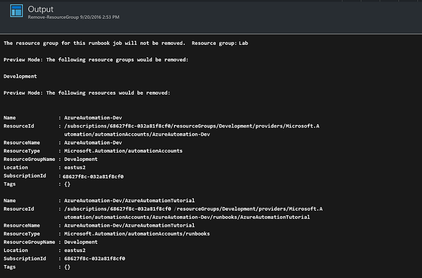

<properties
    pageTitle="Automatisieren der Entfernung von Ressourcengruppen | Microsoft Azure"
    description="PowerShell-Workflow-Version eines Azure Automation-Szenarios mit Runbooks zum Entfernen aller Ressourcengruppen in Ihrem Abonnement."
    services="automation"
    documentationCenter=""
    authors="MGoedtel"
    manager="jwhit"
    editor=""
	/>
<tags
    ms.service="automation"
    ms.workload="tbd"
    ms.tgt_pltfrm="na"
    ms.devlang="na"
    ms.topic="get-started-article"
    ms.date="09/26/2016"
    ms.author="magoedte"/>

# Azure Automation-Szenario – Automatisieren der Entfernung von Ressourcengruppen

Viele Kunden erstellen mehrere Ressourcengruppen, sodass einige speziell für die Verwaltung von Produktionsanwendungen und andere etwa für Entwicklungs-, Test- und Stagingumgebungen verwendet werden können. Dabei kann nicht nur die Bereitstellung dieser Ressourcen automatisiert werden, es ist auch möglich, eine Ressourcengruppe mit nur einem Klick außer Betrieb zu setzen. Automation ist für diesen Anwendungsfall (und damit für die Optimierung dieser weit verbreiteten Verwaltungsaufgabe) wie geschaffen. Darüber hinaus ist dieses Szenario auch hilfreich, wenn Sie ein Azure-Abonnement mit einem durch ein Mitgliedsangebot wie MSDN oder das Microsoft Partner Network Cloud Essentials-Programm bedingten Ausgabenlimit verwenden.

Dieses Szenario basiert auf einem PowerShell-Runbook und dient dazu, einzelne oder mehrere Ressourcengruppen aus Ihrem Abonnement zu entfernen. Das Runbook ist standardmäßig so konfiguriert, dass vor dem Durchführen der Aktion zunächst ein Test durchgeführt wird. Dadurch wird sichergestellt, dass erst dann ein Löschvorgang ausgeführt wird, wenn Sie absolut sicher sind, dass Sie den Vorgang ausführen möchten.

## Abrufen des Szenarios

Dieses Szenario basiert auf einem PowerShell-Runbook, das Sie aus dem [PowerShell-Katalog](https://www.powershellgallery.com/packages/Remove-ResourceGroup/1.0/DisplayScript) herunterladen oder direkt aus dem [Runbookkatalog](automation-runbook-gallery.md) des Azure-Portals importieren können.  

Runbook | Beschreibung|
----------|------------|
Remove-ResourceGroup | Entfernt eine oder mehrere Azure-Ressourcengruppen und deren Ressourcen aus dem Abonnement.  
  Für dieses Runbook sind folgende Eingabeparameter definiert:

Parameter | Beschreibung|
----------|------------|
NameFilter (erforderlich) | Ermöglicht die Angabe eines Namensfilters zur Einschränkung der zu löschenden Ressourcengruppen. Mehrere Werte können in Form einer kommagetrennten Liste übergeben werden. Bei dem Filter wird die Groß-/Kleinschreibung nicht berücksichtigt, und jede Ressourcengruppe, die die Zeichenfolge enthält, wird als Übereinstimmung betrachtet.|
PreviewMode (optional) | Das Runbook wird ausgeführt, um zu ermitteln, welche Ressourcengruppen gelöscht werden, es wird aber keine Aktion ausgeführt. Der Wert ist standardmäßig auf **true** festgelegt, um das versehentliche Löschen einzelner oder mehrerer Ressourcengruppen zu vermeiden, die an das Runbook übergeben wurden.  

## Installieren und Konfigurieren dieses Szenarios

### Voraussetzungen

Dieses Runbook verwendet zur Authentifizierung das [ausführende Konto von Azure](automation-sec-configure-azure-runas-account.md).

### Installieren und Veröffentlichen der Runbooks

Nach dem Herunterladen des Runbooks können Sie es mithilfe des in [Erstellen oder Importieren eines Runbooks in Azure Automation](automation-creating-importing-runbook.md#importing-a-runbook-from-a-file-into-Azure-Automation) beschriebenen Verfahrens importieren. Veröffentlichen Sie das Runbook, nachdem Sie es in Ihr Automation-Konto importiert haben.

## Verwenden des Runbooks

Die folgenden Schritte veranschaulichen die Ausführung dieses Runbooks, damit Sie sich mit dessen Funktionsweise vertraut machen können. Das Runbook wird in diesem Beispiel lediglich getestet. Die Ressourcengruppe wird also nicht wirklich gelöscht.

1. Öffnen Sie im Azure-Portal Ihr Automation-Konto, und klicken Sie auf die Kachel **Runbooks**.
2. Wählen Sie das Runbook **Remove-ResourceGroup** aus, und klicken Sie auf **Starten**.
3. Wenn Sie das Runbook starten, öffnet sich das Blatt **Runbook starten**. Hier können Sie für die Parameter die folgenden Werte konfigurieren. Geben Sie den Namen einer oder mehrerer Ressourcengruppen in Ihrem Abonnement ein, die Sie zum Testen verwenden möchten und bei denen es keine Rolle spielt, wenn sie versehentlich gelöscht werden.  
    
    >[AZURE.NOTE] Vergewissern Sie sich, dass die **PreviewMode**-Option auf **true** festgelegt ist, um eine Löschung der ausgewählten Ressourcengruppen zu vermeiden. **Hinweis:** Die Ressourcengruppe mit dem Automation-Konto, unter dem das Runbook ausgeführt wird, wird von diesem Runbook nicht entfernt.

4. Klicken Sie nach dem Konfigurieren aller Parameterwerte auf **OK**, um das Runbook der Ausführungswarteschlange hinzuzufügen.

Die Details des Runbookauftrags **Remove-ResourceGroup** können Sie im Azure-Portal durch Auswählen der Kachel **Aufträge** des Runbooks anzeigen. Die Auftragszusammenfassung zeigt die Eingabeparameter und den Ausgabedatenstrom sowie allgemeine Informationen zum Auftrag und alle ggf. aufgetretenen Ausnahmen an.  .

Die **Auftragszusammenfassung** beinhaltet Meldungen aus den Ausgabe-, Warnungs- und Fehlerdatenströmen. Wählen Sie die Kachel **Ausgabe** aus, um detaillierte Ergebnisse der Runbookausführung anzuzeigen.  

## Nächste Schritte

- Informationen zum Einstieg in die Erstellung eigener Runbooks finden Sie unter [Erstellen oder Importieren eines Runbooks in Azure Automation](automation-creating-importing-runbook.md).
- Informationen zu den ersten Schritten mit PowerShell-Workflow-Runbooks finden Sie unter [Mein erstes PowerShell-Workflow-Runbook](automation-first-runbook-textual.md).

<!---HONumber=AcomDC_0928_2016-->