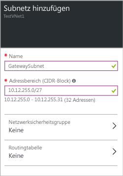

1. Navigieren Sie im Portal zu dem virtuellen Netzwerk, mit dem Sie ein Gateway verbinden möchten.

2. Klicken Sie auf dem VNet-Blatt im Abschnitt **Einstellungen** auf **Subnetze**, um das Blatt „Subnetze“ zu erweitern.

3. Klicken Sie auf dem Blatt **Subnetze** oben auf **+Gatewaysubnetz**. Dadurch wird das Blatt **Subnetz hinzufügen** geöffnet. Der **Name** für Ihr Subnetz wird automatisch mit dem Wert für „GatewaySubnet“ gefüllt. Dieser Wert ist erforderlich, damit Azure das Subnetz als Gatewaysubnetz erkennt.

	

4. Sie können den CIDR-Block für den Adressbereich ändern, sofern erforderlich. Überprüfen Sie die spezifischen Anforderungen für Ihre Konfiguration, um den empfohlenen CIDR-Block zu bestätigen.

5. Klicken Sie unten auf dem Blatt auf **OK**, um das Subnetz zu erstellen.

<!----HONumber=AcomDC_0810_2016-->